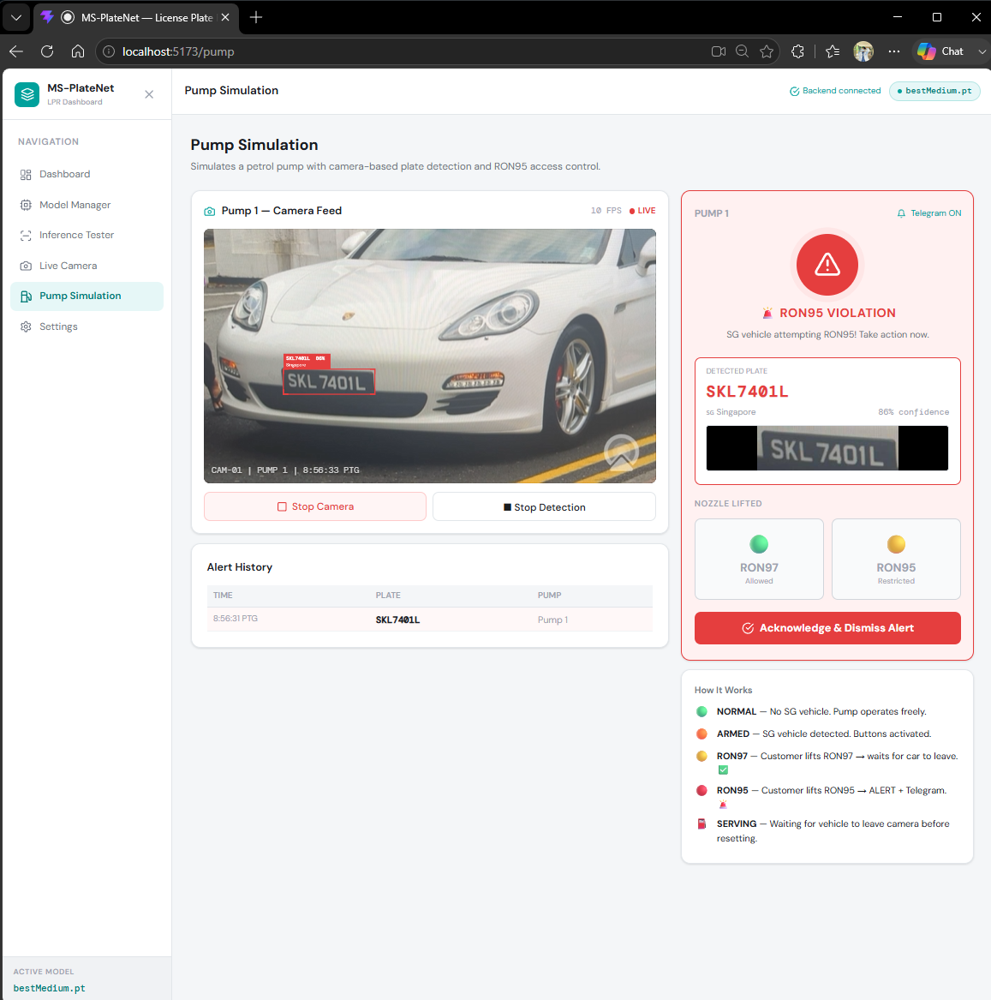
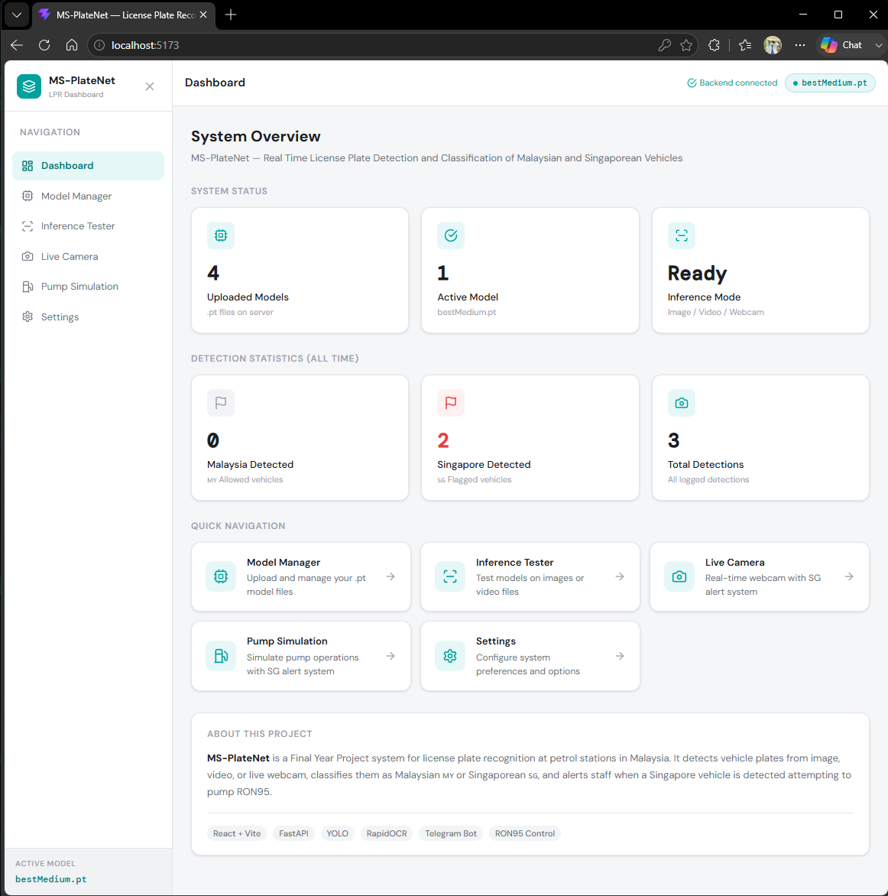

# MS-PlateNet: Real-Time License Plate Detection and Classification of Malaysian and Singaporean Vehicles

[](https://www.python.org/)
[](https://fastapi.tiangolo.com/)
[](https://react.dev/)
[](https://docs.ultralytics.com/)
[](https://www.utem.edu.my/)

**MS-PlateNet** is an end-to-end, real-time computer vision and web-based monitoring system engineered to detect, recognize, and classify vehicle registration plates from **Malaysia** and **Singapore**. Developed as a Final Year Project (PSM) at Universiti Teknikal Malaysia Melaka (UTeM), the system specifically addresses automated fuel subsidy enforcement at petrol stations (preventing unauthorized foreign-registered vehicles from purchasing subsidized RON95 fuel) and cross-border traffic monitoring.

---

## 📌 System Architecture & Pipeline

The system follows a multi-stage real-time AI pipeline:

```text
[ RTSP / Webcam Stream ]
          │
          ▼
┌──────────────────────────────────────────────┐
│  1. Vehicle Plate Detection (YOLOv8m)        │
│     - Input: 640x640 frame                   │
│     - Bounding box extraction & cropping     │
└──────────────────────┬───────────────────────┘
                       │ Crop
                       ▼
┌──────────────────────────────────────────────┐
│  2. Character Recognition (fast-plate-ocr)   │
│     - GPU-accelerated ONNX inference         │
│     - Outputs raw alphanumeric string        │
└──────────────────────┬───────────────────────┘
                       │ Plate Text
                       ▼
┌──────────────────────────────────────────────┐
│  3. Rule-Based Country Classification        │
│     - Singapore: ^S[A-Z]{1,3}\d{1,4}[A-Z]$    │
│     - Malaysia:  ^[A-Z]{1,3}\d{1,4}[A-Z]{0,2}$ │
│     - Fast-fail Unknown fallback             │
└──────────────────────┬───────────────────────┘
                       │ Country + Plate
                       ▼
┌──────────────────────────────────────────────┐
│  4. Fuel Pump Simulation & Access Logic      │
│     - Malaysian Vehicle  -> NORMAL (Dispense)│
│     - Singaporean Vehicle-> ALERT (Lock Pump)│
│     - Unknown Vehicle    -> ARMED  (Manual)  │
└──────────────────────┬───────────────────────┘
                       │
       ┌───────────────┴───────────────┐
       ▼                               ▼
┌──────────────┐             ┌─────────────────────┐
│  WebSockets  │             │ Telegram Bot Alert  │
│  React UI    │             │ Instant push notify │
└──────────────┘             └─────────────────────┘
```

---

## 🚀 Key Features

* **Real-Time Video Inference**: GPU-accelerated inference running at **~53.3 FPS (~18.76 ms latency)** on an NVIDIA RTX 4070 GPU.
* **Plate Voter Smoothing**: Multi-frame sliding window voting algorithm (`plate_voter.py`) preventing jitter and erroneous OCR reads.
* **Dynamic Pump State Machine**:
  * **NORMAL (Green)**: Malaysian plate detected; fuel dispenser unlocked.
  * **ARMED (Yellow)**: Unknown plate format; operator manual confirmation required.
  * **ALERT (Red)**: Singaporean plate detected attempting RON95 fueling; fuel nozzle disabled.
* **Automated Video & Crop Archiving**: Incident footage automatically clipped into H.264 MP4 using FFmpeg for audit trails.
* **Bilingual Telegram Notifications**: Sends real-time photo evidence and incident details directly to station managers.
* **Full-Stack Web Dashboard**: Built with React 18, Vite, Tailwind CSS, and Lucide icons communicating over WebSocket + REST.

---

## 📸 System Screenshots

| Live Detection & Camera Stream | Fuel Pump State Control |
| :---: | :---: |
|  |  |

| Dashboard Analytics | Model Management |
| :---: | :---: |
|  |  |

---

## 🛠️ Tech Stack

### Backend & AI Engine
* **Framework**: Python 3.12, FastAPI, Uvicorn (ASGI)
* **Computer Vision**: Ultralytics YOLOv8 (PyTorch / CUDA), OpenCV
* **OCR Engine**: `fast-plate-ocr` with ONNX Runtime GPU acceleration
* **Database & ORM**: PostgreSQL, SQLAlchemy (asyncpg)
* **Media Processing**: FFmpeg (H.264 video encoding)
* **Alerting**: Telegram Bot API

### Frontend
* **Core**: React 18, Vite 5, JavaScript (ES Modules)
* **Styling**: Tailwind CSS, Lucide React
* **Networking**: Axios (REST), native WebSocket (bidirectional real-time stream)

---

## 📦 Project Directory Structure

```text
ms-platenet/
├── backend/                  # FastAPI backend server
├── database/                 # PostgreSQL schema & seed data (schema.sql)
│   ├── routers/              # API endpoints (inference, stream, alerts, etc.)
│   ├── database.py           # PostgreSQL connection configuration
│   ├── models_db.py          # Database schema models
│   ├── plate_voter.py        # Temporal sliding-window voting algorithm
│   ├── main.py               # Main application entrypoint
│   └── requirements.txt      # Python package dependencies
├── frontend/                 # React Vite frontend application
│   ├── src/                  # Components, pages, layout & API clients
│   ├── public/               # Static web assets
│   └── package.json          # Node package dependencies
├── Model Trained/            # Pre-trained model weights (bestMedium.pt)
├── Notebook Jupyter/         # Research & training notebooks
│   ├── ms-platenet-v5.ipynb  # YOLOv8 training, validation & evaluation
│   └── OCRcomparison.ipynb   # Benchmark comparisons (EasyOCR, PaddleOCR, FastPlateOCR)
└── img/                      # System diagrams and screenshots
```

---

## ⚡ Getting Started & Installation

### Prerequisites
* Python 3.10+ (Python 3.12 recommended with CUDA 12.x support)
* Node.js 18+ and npm
* PostgreSQL database
* FFmpeg installed and added to system PATH

---

### 1. Backend Setup

```bash
# Navigate to the backend directory
cd backend

# Create and activate a Python virtual environment
python -m venv .venv
# On Windows:
.venv\Scripts\activate
# On Linux / macOS:
source .venv/bin/activate

# Install required Python packages
pip install -r requirements.txt

# Create your environment file from the template
cp .env.example .env
# Edit .env and fill in your Telegram Bot token and database settings
```

Start the backend server:
```bash
uvicorn main:app --reload --host 0.0.0.0 --port 8000
```
The API will be accessible at `http://localhost:8000` (Swagger docs at `http://localhost:8000/docs`).

---

### 2. Frontend Setup

Open a new terminal window:

```bash
# Navigate to the frontend directory
cd frontend

# Install dependencies
npm install

# Copy environment template
cp .env.example .env

# Start the Vite development server
npm run dev
```
The web dashboard will be accessible at `http://localhost:5173`.

---

## 📊 Evaluation & Benchmark Results

* **Detection mAP@0.5**: `0.8892` (Exceeding the project target requirement of `0.850`).
* **Exact OCR Match Rate**: `86.0%` on 100 test plates (FastPlateOCR outperforms EasyOCR and PaddleOCR).
* **Average Character Similarity**: `96.1%`.
* **End-to-End Latency**: `18.76 ms` per frame (~53.3 FPS on an NVIDIA RTX 4070 GPU).

---

## 👨‍💻 Author & Academic Information

* **Student**: Muhammad Khairul Afiq bin Abdullah (Matric: B032310802)
* **Program**: Bachelor of Computer Science (Artificial Intelligence) with Honours
* **Faculty**: Faculty of Artificial Intelligence and Cyber Security (FAIKS)
* **Institution**: Universiti Teknikal Malaysia Melaka (UTeM)
* **Supervisor**: Ts. Dr. Norfadzlia binti Mohd Yusof
